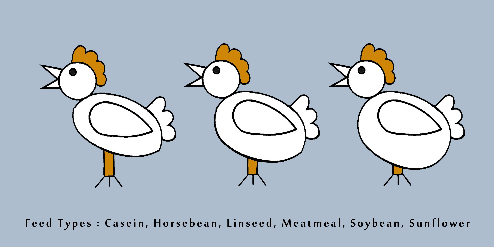
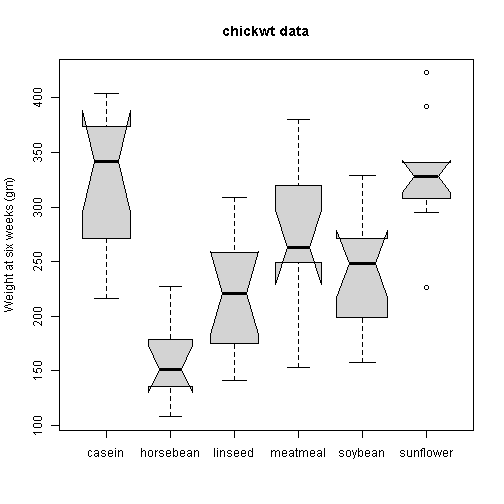
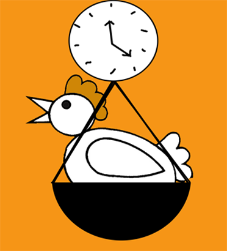
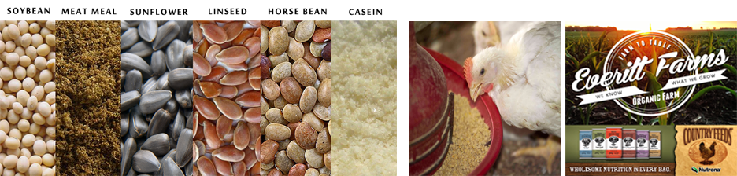
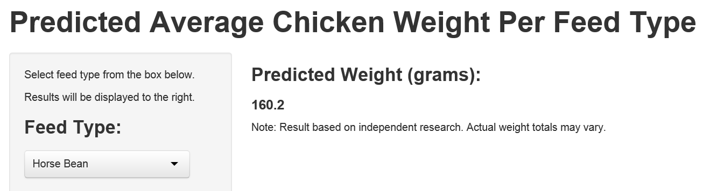
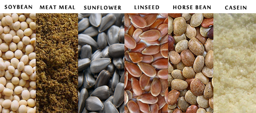
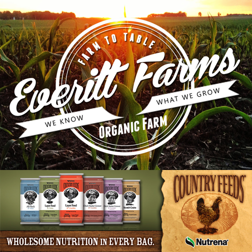

 Raising Fat Chickens!
========================================================
author:Shannon Hart
date: 10.24.2014
transition: rotate
font-family: 'MoolBoran'
type: sub-section
autosize: true


# Predicting Chicken Weight 
# Based on Feed Type


========================================================
The Effects of Feed Type on Chicken Weight

<small>An experiment was conducted to measure and compare the effectiveness of various feed supplements on the growth rate of chickens.  Newly hatched chicks were randomly allocated into six groups.  Each group was given a different feed supplement. At the end of 6 weeks, their weights were recorded along with feed types. </small>


========================================================
Summary of Data Collected : 
Average Chicken Weight by Feed Type



71 observations were recorded on 2 variables: 
Weight x Feed Type


<small>Using this data set (chickwts) we will create a simple Shiny app to help farmers predict the weight of their chickens according to the type of feed the chickens are fed.</small>


========================================================
Preparing the Data

<small>
I split this numeric and factor variable dataset into feed types then mapped the new list of variables to find the mean chicken weight from each feed type. The mean weight values of each feed type will be the predicted values in this simple chicken app.</small>


***

```
$casein
[1] 323.6

$horsebean
[1] 160.2

$linseed
[1] 218.8

$meatmeal
[1] 276.9

$soybean
[1] 246.4

$sunflower
[1] 328.9
```


==========================
Simple Code to Process Data into Weight Mean X Feed Type

```r
weights= with(chickwts,split(weight,feed))
Map(mean,weights)
```
Customer will be asked to select feed type from drop down menu. The mean weight result of (x) feed type will be displayed as predicted value.




===================
App Screen Shot - Preview

<small>
Free web app available to feed sites to incoporate into eCommerce services. </small>


****


<small>Live app preview here:  [Chicken Weight Predictor](http://shannonhartreed.shinyapps.io/DataProducts/)</small>
